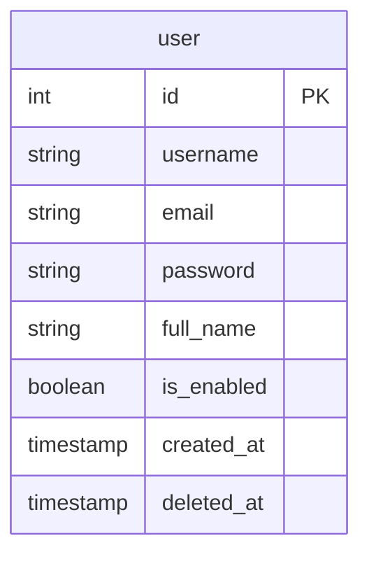

# 🎯目的

- まずはFastAPIとMySQLを使用した簡単なCRUD操作を試してみる
- FastAPIの基本的な機能と、データベースとの連携方法を理解する。

# 前回の内容

今回はFastAPIのプロジェクト構築後からのものになります。

https://zenn.dev/kou_kawa/articles/07-first-fastapi

# ✨SQLAlchemyとは

Pythonプログラミング言語のためのオープンソースのSQLツールキットおよびオブジェクト関係マッピングライブラリ（ORM）。MIT Licenseの下で公開されている。SQLAlchemyの主な哲学は、リレーショナルデータベースとオブジェクトコレクションの間の振る舞いの違いを扱うことにある。この為、SQLAlchemyはアクティブレコードパターンではなく、データマッパーパターンを採用している。

# ✨pydanticとは

Pythonのデータバリデーションと設定管理を使用するためのライブラリ。主に型ヒントを使用してデータの検証と直列化を行う。これにより、データの検証エラーや不正なデータの取り扱いが簡単になる。

# ✨同期的セッション、非同期的セッション

- 実行方法:
  - 同期的セッション: クエリが実行されると、そのクエリが完了するまでプログラムの実行がブロックされます。つまり、クエリがデータベースで実行されている間、他の操作は待機状態となります。
  - 非同期的セッション: クエリが実行されると、プログラムの実行はブロックされずに進行します。クエリが完了したら、結果が後で返されます。これにより、他の操作を同時に行うことができます。

- パフォーマンスとスケーラビリティ:
  - 同期的セッション: 同時に多くのリクエストがある場合、各リクエストがデータベース操作を待っている間、リソースがブロックされる可能性があります。これにより、スケーラビリティに制限が生じる場合があります。
  - 非同期的セッション: データベース操作がブロックされないため、同時に多くのリクエストを効率的に処理することができます。これにより、高いスケーラビリティが得られます。

- コードの書き方:
  - 同期的セッション: 通常の関数やメソッドを使用してクエリを実行します。
  - 非同期的セッション: async/await 構文を使用してクエリを実行します。

- 使用ケース:
  - 同期的セッション: 単純なアプリケーションや、同時に多くのリクエストが予想されない場合に適しています。
  - 非同期的セッション: 同時に多くのリクエストがあるアプリケーションや、高いスケーラビリティが必要な場合に適しています。

- サポートされているデータベースドライバ:
  - 同期的セッション: 多くのデータベースドライバが同期的な操作をサポートしています。
  - 非同期的セッション: 非同期操作をサポートするデータベースドライバが必要です。すべてのデータベースドライバが非同期操作をサポートしているわけではありません。

# テーブル仕様

今回説明で使用するテーブルは以下とする。



※ passwordカラムは通常暗号化済の文字列とするが、今回はお試しの為、平文とする。
   実際はどのように暗号化するか設計する必要がある。

# API仕様

今回のAPIは以下とする。RestfulなAPIとする。

```
# method: POST データの追加
# request body: JSONデータ(ユーザーデータ)
# response body： JSONデータ(追加後のユーザーデータ)
[ドメイン]/user/

# method: GET データの取得
# request body: なし
# response body： JSONデータ(ユーザーデータ)
[ドメイン]/user/all
[ドメイン]/user/[id]

# method: PUT データの更新
# request body: JSONデータ
# response body： JSONデータ(変更後のユーザーデータ)
[ドメイン]/user/[id]

# method: DELETE データの削除
# response body： 成功の場合、1。それ以外はエラー。
[ドメイン]/user/[id]
```

# 使用バージョン

今回使用するバージョンは以下とする。

- Python  3.10.7
- FastAPI 0.104.0
- MariaDB 10.4.28(XAMPPで使用してるバージョン。最新検討予定)

# 必要なパッケージのインストール

```bash
pip install pymysql pydantic sqlalchemy databases pydantic[email]
```

- pymysql: MySQLデータベースとの接続をサポートするPythonの純粋なPython MySQLクライアント
- pydantic: データバリデーションとデータのシリアル化/デシリアル化をサポートするライブラリ。FastAPIとの統合が深い。
- sqlalchemy: SQLツールキットおよびObject-Relational Mapping (ORM) ライブラリ。
- databases: SQLAlchemyと非同期データベースの統合をサポートするライブラリ。
- pydantic[email]: pydanticのemailバリデーションサポート。

# プロジェクトフォルダ構成

```
.
├── app
│   ├── database
│   │   ├── __init__.py
│   │   └── database.py
│   ├── models
│   │   ├── pydantic
│   │   │   ├── __init__.py
│   │   │   └── user.py
│   │   ├── sqlalchemy
│   │   │   ├── __init__.py
│   │   │   └── user.py
│   ├── routers
│   │   ├── __init__.py
│   │   └── user.py 
│   └── main.py
└── requirements.txt
```

# main.py

```python
from fastapi import FastAPI
from .routers import user

app = FastAPI()

app.include_router(user.router)
```

# database/database.py

SQLAlchemyは同期的なセッションメソッドを使用。
非同期的なセッションメソッドの変更方法は割愛する。

```python
from sqlalchemy import create_engine
from sqlalchemy.ext.declarative import declarative_base
from sqlalchemy.orm import sessionmaker

SQLALCHEMY_DATABASE_URL = "mysql+pymysql://[ユーザー]:[パスワード]@[ホスト名]/[データベース名]"
engine = create_engine(SQLALCHEMY_DATABASE_URL, echo=True)
SessionLocal = sessionmaker(autocommit=False, autoflush=False, bind=engine)
Base = declarative_base()

def get_db():
    db = SessionLocal()
    try:
        yield db
    finally:
        db.close()
```

# models/sqlalchemy/user.py

```python
from sqlalchemy import Boolean, Column, Integer, String, DateTime, func
from sqlalchemy.orm import relationship
from app.database.database import Base

class User(Base):
    __tablename__ = "[ユーザーテーブル名]"

    id = Column(Integer, primary_key=True, index=True, autoincrement=True)
    username = Column(String(50), unique=True, index=True, nullable=False)
    email = Column(String(75), unique=True, index=True, nullable=False)
    password = Column(String(128), unique=True, index=True, nullable=False)
    full_name = Column(String(100), unique=True, index=True, nullable=True)
    is_enabled = Column(Boolean, default=True, nullable=False)
    created_at = Column(DateTime(timezone=True), server_default=func.now(), nullable=False)
    updated_at = Column(DateTime(timezone=True), server_default=func.now(), onupdate=func.now(), nullable=False)
```

# models/pydantic/user.py

```python
from datetime import datetime
from typing import Optional
from pydantic import BaseModel, EmailStr

class UserCreate(BaseModel):
    username: Optional[str] = None
    email: Optional[EmailStr] = None
    password: Optional[str] = None
    full_name: Optional[str] = None
    is_enabled: Optional[bool] = None

class UserUpdate(BaseModel):
    username: Optional[str] = None
    email: Optional[EmailStr] = None
    password: Optional[str] = None
    full_name: Optional[str] = None
    is_enabled: Optional[bool] = None

class UserResponse(BaseModel):
    id: int
    username: Optional[str] = None
    email: Optional[EmailStr] = None
    password: Optional[str] = None
    full_name: Optional[str] = None
    is_enabled: Optional[bool] = None
    created_at: datetime
    updated_at: datetime

    class Config:
        orm_mode = True
```

# routers/user.py

### POST /user/ データの挿入

```python
from fastapi import APIRouter, Depends, HTTPException, status
from fastapi.responses import JSONResponse
from sqlalchemy.orm import Session, joinedload

from app.database.database import get_db
from app.models.sqlalchemy.user import User as DBUser
from app.models.pydantic.user import UserCreate, UserResponse, UserUpdate

router = APIRouter()

@router.post("/user/", response_model=UserResponse)
async def create_user(user: UserCreate, db: Session = Depends(get_db)):
    db_user = DBUser(**user.dict())
    db.add(db_user)
    db.commit()
    db.refresh(db_user)
    return db_user

# (省略)
```

### PostmanでAPI確認(POST)

ユーザーデータをリクエストボディに設定し実行する。
レスポンスデータでユーザーデータが返ってきたので成功！


### GET /user/all 全データ取得

```python
# (省略)

@router.get("/user/all/")
def read_user_all(db: Session = Depends(get_db)):
    try:
        users_data = db.query(DBUser).all()
        results = [
            {
                "id": user.id,
                "username": user.username,
                "email": user.email,
                "password": user.password,
                "full_name": user.full_name,
                "is_enabled": user.is_enabled,
                "created_at": user.created_at.isoformat() if user.created_at else None,
                "updated_at": user.updated_at.isoformat() if user.updated_at else None,
            }
            for user in users_data
        ]
        return JSONResponse(content=results)
    except Exception as e:
        raise HTTPException(status_code=500, detail=str(e))

# (省略)
```

### PostmanでAPI確認(GET)

レスポンスデータで全ユーザーデータが返ってきたので成功！


### GET /user/[ユーザーのid] ユーザーIDからデータ取得 

```python
# (省略)
@router.get("/user/{user_id}", response_model=UserResponse)
def read_user_by_id(user_id: int, db: Session = Depends(get_db)):
    db_user = db.query(DBUser).filter(DBUser.id == user_id).first()
    if db_user is None:
        raise HTTPException(status_code=status.HTTP_404_NOT_FOUND, detail="User not found")
    return db_user
# (省略)
```

### PostmanでAPI確認(GET)

URLの「URLパラメータ」に取得したいユーザーIDを設定。
レスポンスデータでユーザーデータが返ってきたので成功！


### PUT /user/[ユーザーのid] ユーザーIDからデータ更新

```python
# (省略)
@router.put("/user/{user_id}", response_model=UserResponse)
async def update_user(user_id: int, user_update: UserUpdate, db: Session = Depends(get_db)):
    try:
        db_user = db.query(DBUser).filter(DBUser.id == user_id).first()
        if db_user is None:
            raise HTTPException(status_code=status.HTTP_404_NOT_FOUND, detail="User not found")

        for key, value in user_update.dict(exclude_unset=True).items():
            setattr(db_user, key, value)

        db.commit()
    except SQLAlchemyError as e:
        db.rollback()
        raise HTTPException(status_code=status.HTTP_400_BAD_REQUEST, detail=str(e)) from e
    finally:
        db.refresh(db_user)
        return db_user
# (省略)
```

### PostmanでAPI確認(PUT)

URLの「URLパラメータ」に更新したいユーザーIDを設定。
更に変更したいユーザーデータをリクエストボディに設定し実行する。
レスポンスデータでユーザーデータが格納され、変更データとなっており成功！


### DELETE /user/[ユーザーのid] ユーザーIDからデータ削除

```python
# (省略)
@router.delete("/user/{user_id}", status_code=status.HTTP_204_NO_CONTENT)
async def delete_user(user_id: int, db: Session = Depends(get_db)):
    db_user = db.query(DBUser).filter(DBUser.id == user_id).first()
    if db_user is None:
        raise HTTPException(status_code=status.HTTP_404_NOT_FOUND, detail="User not found")

    db.delete(db_user)
    db.commit()
# (省略)
```

### PostmanでAPI確認(DELETE)

URLの「URLパラメータ」に削除したいユーザーIDを設定。
エラーが返ってこない場合は成功！


# 次回内容

FastAPIとMySQLの連携方法を確認しました。
次回は外部キーのあるテーブルを追加し、データベースの操作を拡大しようと思います。

最後までお読みいただきありがとうございました！