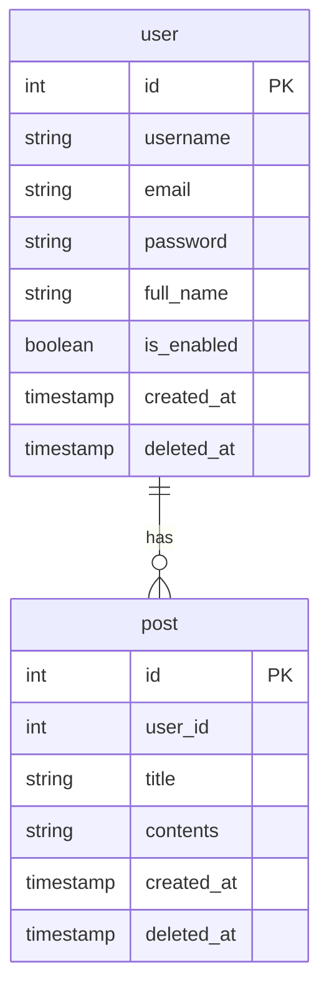

# 🎯目的

- 外部キーのあるテーブルが追加された。結合やグループ化してデータを取得する。
- FastAPIで複雑なデータを取得する。

# 前回の内容

今回はFastAPIでデータベースとの連携を行った後からのものになります。

https://zenn.dev/kou_kawa/articles/08-first-mysql-fastapi

# テーブル仕様

前回のテーブルを修正する。修正したテーブルは以下とする。



# API仕様

今回はpost側のテーブルのCRUD操作のAPIは割愛する。
user側のテーブルの取得APIを修正する。

```
# method: GET データの取得
# request body: なし
# response body: 各取得データ
[ドメイン]/user/all
[ドメイン]/user/[id]
[ドメイン]/user/group
```

# 使用バージョン

今回使用するバージョンは以下とする。

- Python  3.10.7
- FastAPI 0.104.0
- MariaDB 10.4.28(XAMPPで使用してるバージョン。最新検討予定)

# プロジェクトフォルダ構成

```
.
├── app
│   ├── database
│   │   ├── __init__.py
│   │   └── database.py
│   ├── models
│   │   ├── pydantic
│   │   │   ├── __init__.py
│   │   │   ├── post.py(省略)
│   │   │   └── user.py
│   │   ├── sqlalchemy
│   │   │   ├── __init__.py
│   │   │   ├── post.py
│   │   │   └── user.py
│   ├── routers
│   │   ├── __init__.py
│   │   ├── post.py(省略)
│   │   └── user.py 
│   └── main.py
└── requirements.txt
```

# models/sqlalchemy/user.py

「posts = relationship("Post", back_populates="user")」を追加。

```python
from sqlalchemy import Boolean, Column, Integer, String, DateTime, func
from sqlalchemy.orm import relationship
from app.database.database import Base

class User(Base):
    __tablename__ = "[userテーブル名]"

    id = Column(Integer, primary_key=True, index=True, autoincrement=True)
    username = Column(String(50), unique=True, index=True, nullable=False)
    email = Column(String(75), unique=True, index=True, nullable=False)
    password = Column(String(128), unique=True, index=True, nullable=False)
    full_name = Column(String(100), unique=True, index=True, nullable=True)
    is_enabled = Column(Boolean, default=True, nullable=False)
    created_at = Column(DateTime(timezone=True), server_default=func.now(), nullable=False)
    updated_at = Column(DateTime(timezone=True), server_default=func.now(), nullable=False, onupdate=func.now())

    posts = relationship("Post", back_populates="user")
```

# models/sqlalchemy/post.py

```python
from sqlalchemy import Column, Integer, String, Text, ForeignKey, DateTime, func
from sqlalchemy.orm import relationship
from app.database.database import Base

class Post(Base):
    __tablename__ = "[postテーブル名]"

    id = Column(Integer, primary_key=True, index=True, autoincrement=True)
    title = Column(String(100), nullable=True)
    contents = Column(Text, nullable=True)
    user_id = Column(Integer, ForeignKey("[userテーブル名].id"), nullable=True)
    created_at = Column(DateTime(timezone=True), server_default=func.now(), nullable=False)
    updated_at = Column(DateTime(timezone=True), server_default=func.now(), nullable=False, onupdate=func.now())

    user = relationship("User", back_populates="posts")
```

# routers/user.py

### GET /user/all 全データ取得

```python
from fastapi import APIRouter, Depends, HTTPException, status
from fastapi.responses import JSONResponse
from sqlalchemy.orm import Session, joinedload

from app.database.database import get_db
from app.models.sqlalchemy.user import User as DBUser
from app.models.sqlalchemy.post import Post as DBPost
from app.models.pydantic.user import UserCreate, UserResponse, UserUpdate

# (省略)

@router.get("/user/all")
def read_user_all(db: Session = Depends(get_db)):
    try:
        users_with_posts = db.query(DBUser).options(joinedload(DBUser.posts)).all()
        results = [
            {
                "id": user.id,
                "username": user.username,
                "email": user.email,
                "password": user.password,
                "full_name": user.full_name,
                "is_enabled": user.is_enabled,
                "created_at": user.created_at.isoformat() if user.created_at else None,
                "updated_at": user.updated_at.isoformat() if user.updated_at else None,
                "posts": [{
                    "post_id": post.id, 
                    "post_title": post.title,
                    "post_contents": post.contents,
                    "post_created_at": post.created_at.isoformat() if post.created_at else None,
                    "post_updated_at": post.updated_at.isoformat() if post.updated_at else None
                } for post in user.posts],
            }
            for user in users_with_posts
        ]
        return JSONResponse(content=results)
    except Exception as e:
        raise HTTPException(status_code=500, detail=str(e))
# (省略)
```

### PostmanでAPI確認(GET)

レスポンスデータで全ユーザーデータが返ってきたので成功！


### GET /user/[ユーザーのid] ユーザーIDからデータ取得 

```python
# (省略)
@router.get("/user/{user_id}")
def read_user_by_id(user_id: int, db: Session = Depends(get_db)):
    db_user = db.query(DBUser).options(joinedload(DBUser.posts)).filter(DBUser.id == user_id).first()
    if db_user is None:
        raise HTTPException(status_code=status.HTTP_404_NOT_FOUND, detail="User not found")
    results = {
        "id": db_user.id,
        "username": db_user.username,
        "email": db_user.email,
        "password": db_user.password,
        "full_name": db_user.full_name,
        "is_enabled": db_user.is_enabled,
        "created_at": db_user.created_at.isoformat() if db_user.created_at else None,
        "updated_at": db_user.updated_at.isoformat() if db_user.updated_at else None,
        "posts": [{
            "post_id": post.id, 
            "post_title": post.title,
            "post_contents": post.contents,
            "post_created_at": post.created_at.isoformat() if post.created_at else None,
            "post_updated_at": post.updated_at.isoformat() if post.updated_at else None
        } for post in db_user.posts],
    }
    return results
# (省略)
```

### PostmanでAPI確認(GET)

URLの「URLパラメータ」に取得したいユーザーIDを設定。
レスポンスデータでユーザーデータが返ってきたので成功！


### GET /user/group グループ化を使用したデータ取得

```python
@router.get("/user/group")
def read_user_group_user_id(db: Session = Depends(get_db)):
    try:
        user_post_counts = (
            db.query(
                DBUser.id,
                DBUser.username, 
                func.count(DBPost.id).label("post_count"))
            .join(DBPost, DBUser.id == DBPost.user_id)
            .group_by(DBUser.username)
            .all()
        )

        if user_post_counts is None:
            raise HTTPException(status_code=status.HTTP_404_NOT_FOUND, detail="User not found")

        results = [
            {
                "id": record.id,
                "username": record.username,
                "post_count": record.post_count,
            } for record in user_post_counts
        ]
        return JSONResponse(content=results)
    except Exception as e:
        raise HTTPException(status_code=500, detail=str(e))
```

### PostmanでAPI確認(GET)

レスポンスデータでグループ化したユーザーデータが返ってきたので成功！


# 終わりに

この記事を通じて、FastAPIとSQLAlchemyを使用して、外部キーを持つテーブルからの複雑なデータ取得方法を試した。これらのツールを使用することで、効率的にデータを操作し、APIを構築することができる。

最後までお読みいただきありがとうございました！